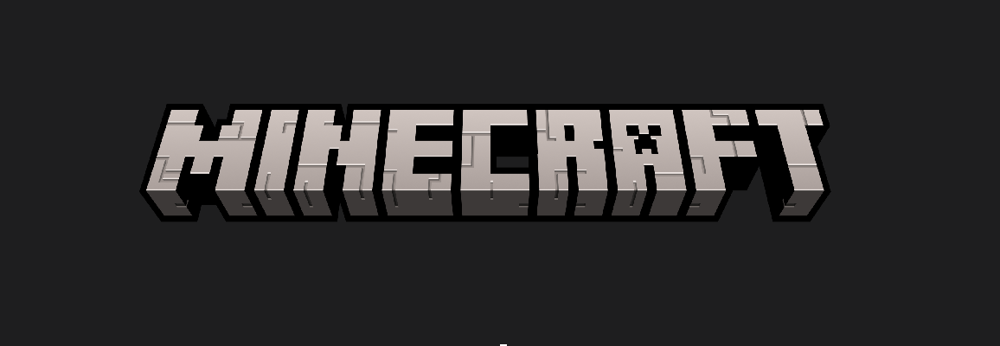

## Table of Contents

- [Step 1:](#step-1-install-java) Step 1: Install Java
- [Step 2:](#step-2-download-the-minecraft-server-software) Step 2: Download the Minecraft Server Software
- [Step 3:](#step-3-create-a-server-folder) Step 3: Create a Server Folder
- [Step 4:](#step-4-launch-the-minecraft-server) Step 4: Launch the Minecraft Server
- [Step 5:](#step-5-accept-the-eula) Step 5: Accept the EULA
- [Step 6:](#step-6-configure-your-server) Step 6: Configure Your Server
- [Step 7:](#step-7-port-forwarding) Step 7: Port Forwarding
- [Step 8:](#step-8-share-your-server-ip) Step 8: Share Your Server IP
- [Step 9:](#step-9-test-and-enjoy!) Step 9: Test and Enjoy!

## **Introduction**

Minecraft, the popular sandbox game, offers an incredible multiplayer experience when played on a server. If you've ever wanted to create your own Minecraft server to play with friends or build a community, you're in the right place. In this step-by-step guide, we'll walk you through the process of setting up a Minecraft server on your PC. Get ready to embark on an exciting journey into the world of Minecraft server hosting!

**Requirements:**

Before we dive into the setup process, make sure you have the following:

1\. A PC (Windows, Linux, or macOS)

2\. A reliable internet connection

3\. At least 4GB of RAM (8GB or more is recommended)

4\. Java Development Kit (JDK) installed

5\. Minecraft Java Edition (for testing)

# **Step 1: Install Java**

Minecraft servers run on Java, so you'll need to ensure you have the Java Development Kit (JDK) installed on your computer. You can download the latest version of the JDK from the official Oracle website or use the open-source alternative, AdoptOpenJDK.

# **Step 2: Download the Minecraft Server Software**

1\. Visit the official Minecraft website (https://www.minecraft.net/en-us/download/server) to download the Minecraft Server software. Be sure to select the version that matches your game version.

2\. Save the downloaded file to a dedicated folder on your PC.

# **Step 3: Create a Server Folder**

Now, it's time to create a folder where you'll store your server files. This folder will contain essential server files and configuration.

1\. Create a new folder on your PC, and give it a descriptive name like "MinecraftServer."

2\. Move the downloaded server file (e.g., `minecraft_server.1.17.1.jar`) into this folder.

# **Step 4: Launch the Minecraft Server**

1\. Open the folder containing the server file.

2\. Right-click the server file and select "Open with" -> "Java(TM) Platform SE Binary."

This will run the Minecraft server for the first time, and it will generate necessary configuration files.

# **Step 5: Accept the EULA**

1\. After running the server, a new file called `eula.txt` will appear in the server folder.

2\. Open `eula.txt` in a text editor.

3\. Change `eula=false` to `eula=true` to accept the End User License Agreement.

# **Step 6: Configure Your Server**

Before your server is ready for multiplayer gaming, you can customize various settings in the `server.properties` file, located in the server folder. You can change things like the server name, game mode, difficulty, and more.

# **Step 7: Port Forwarding**

To allow others to connect to your server, you need to set up port forwarding on your router. Access your router's settings and forward incoming connections on port 25565 (the default Minecraft server port) to your computer's local IP address.

# **Step 8: Share Your Server IP**

Your server is now set up and configured. You can find your server's IP address by searching "What's my IP" on Google. Share this IP with your friends to let them connect to your server.

# **Step 9: Test and Enjoy!**

Launch Minecraft Java Edition on your PC and use "Direct Connect" to join your server using the IP address you just obtained. You can also use the server address if you've set up a domain name.

Congratulations! You've successfully set up your Minecraft server on your PC. Now you can embark on adventures, build together, and enjoy multiplayer Minecraft with your friends and community. Don't forget to explore plugins and mods to enhance your server's gameplay and features. Have a fantastic time in the blocky world of Minecraft!
